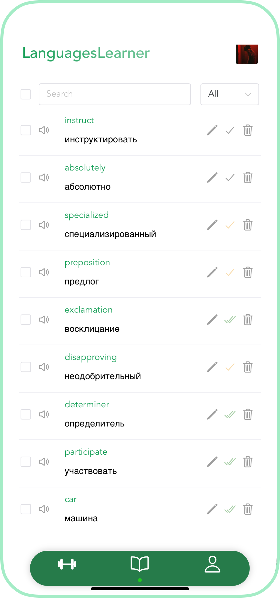
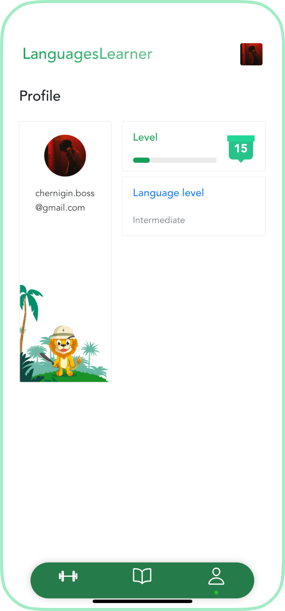

# Languages Learner App

## Overview

This project is a languages learning application that aims to provide an easy and effective way to learn new languages.
It includes the following features:

- Profile Page: Keep track of your progress and see your achievements.
- Settings Page: Customize the app to your preferences.
- Dictionary Page: Store and manage your translations.
- Trainings Page: Develop your language skills with interactive exercises. (Not ready)

## Live Demo

Check out the live demo of the app at https://languages-learner.web.app/

## 🛠 Built with

- [Vue 3][vue]
- [Vite][vite]
- [TypeScript][typescript]
- [Pinia][pinia]: A lightweight state management library for Vue 3.
- [i18n][i18n]: An internationalization library.
    - **Translations Stored in Firestore**: this allows for scalable and flexible management of multilingual content.
- [Firebase][firebase]
  - [Firebase Authentication][firebase-authentication]
  - [Firestore Database][firestore-database]
  - [Firebase Remote Config][firebase-remote-config]
  - [Firebase Hosting][firebase-hosting]
- [Naive-UI][naive-ui]: A set of UI components for Vue 3.

- [Docker][docker]
  - Docker Compose files provided for both development and production environments.
  - Although not currently in use, these Docker Compose files serve as examples for potential containerization of application in the future.

- **PWA Support**
  - [VitePWA][vite-pwa]: Integrate Progressive Web App (PWA) features

- **Automated Tests**
    - [Vitest][vitest]: Unit and Component Tests.
    - [Cypress][cypress] + [Cypress Cloud][cypress-cloud]: End-to-end Tests  across multiple browsers and device sizes.
      - **Include visual regression tests** using [cypress-visual-regression][cypress-visual-regression]

- **CI/CD**
  - Automated Tests: Unit, Component and End-to-end Tests.
  - Deploy:
    - Preview website for pull-requests and delete on PR close
    - Production deploy
  - Reject pending deployments on PR close

- **Code Quality Tools**
    - [ESLint][eslint]
    - [Stylelint][stylelint]

[vue]: https://vuejs.org/
[vite]: https://vitejs.dev/
[typescript]: https://typescriptlang.org
[pinia]: https://pinia.vuejs.org/
[i18n]: https://vue-i18n.intlify.dev/
[firebase]: https://firebase.google.com/
[firebase-authentication]: https://firebase.google.com/docs/auth
[firestore-database]: https://firebase.google.com/docs/firestore
[firebase-remote-config]: https://firebase.google.com/docs/remote-config
[firebase-hosting]: https://firebase.google.com/docs/hosting
[naive-ui]: https://www.naiveui.com/en-US/os-theme
[docker]: https://www.docker.com/
[vite-pwa]: https://github.com/antfu/vite-plugin-pwa
[vitest]: https://vitest.dev/
[cypress]: https://www.cypress.io/
[cypress-cloud]: https://cloud.cypress.io/projects/fm6ypm/runs
[cypress-visual-regression]: https://github.com/cypress-visual-regression/cypress-visual-regression
[eslint]: https://eslint.org/
[stylelint]: https://stylelint.io/

## Preview (Mobile)

[//]: # (![preview-dictionary-page-mobile]&#40;public/preview-dictionary-page-mobile.png&#41;)

[//]: # (![preview-profile-page-mobile]&#40;public/preview-profile-page-mobile.png&#41;)

  
  

